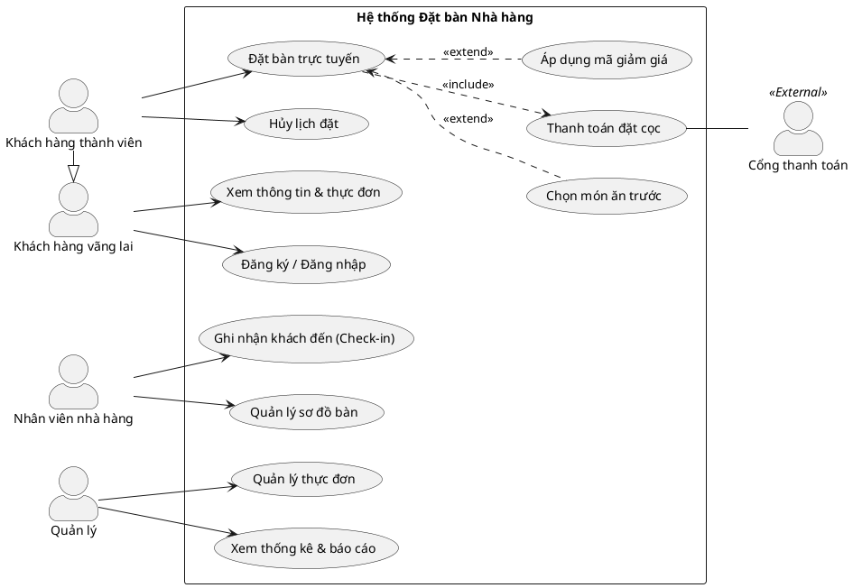

# Báo cáo Tuần 2 – Phân tích và Thiết kế Biểu đồ Use Case Dự án "Hệ thống Đặt bàn Nhà hàng"

Trong tuần thứ 2, nhóm chúng em đã áp dụng các kiến thức lý thuyết về Use Case từ Tuần 1 vào dự án thực tế của nhóm: **Hệ thống Đặt bàn Nhà hàng (Restaurant Booking System)**. Dưới đây là nhật ký chi tiết về quá trình tìm hiểu, phân tích, vẽ biểu đồ và buổi thuyết trình báo cáo trước lớp.

---

## 1. Mục tiêu công việc trong tuần
- Xác định rõ phạm vi (System Boundary) của dự án Đặt bàn Nhà hàng.
- Phân tích và xác định các tác nhân (**Actors**) tương tác với hệ thống.
- Liệt kê các ca sử dụng (**Use Cases**) cốt lõi mang lại giá trị cho người dùng.
- Thiết lập các mối quan hệ giữa các Use Case (`<<include>>`, `<<extend>>`, `Generalization`).
- Phác thảo biểu đồ Use Case (dưới dạng PlantUML và hình vẽ trực quan).
- Thuyết trình báo cáo trước giảng viên (cô giáo) và tiếp thu ý kiến đóng góp để hoàn thiện.

---

## 2. Phân tích Actors & Use Cases của Dự án

Qua quá trình thảo luận nhóm, chúng em đã làm rõ các đối tượng sử dụng hệ thống như sau:

### 2.1. Danh sách Actors (Tác nhân)

| Tác nhân (Actor) | Phân loại | Mô tả vai trò |
|---|---|---|
| **Khách hàng vãng lai (Guest)** | Primary | Người dùng chưa đăng nhập, chỉ có thể xem thực đơn, thông tin nhà hàng và đăng ký tài khoản. |
| **Khách hàng thành viên (Customer)** | Primary | Người dùng đã có tài khoản, thực hiện đặt bàn, đặt món trước, hủy lịch và quản lý lịch sử đặt. (Kế thừa từ Guest). |
| **Nhân viên phục vụ/lễ tân (Staff)** | Primary | Tiếp nhận khách hàng, kiểm tra thông tin đặt bàn khi khách đến, cập nhật trạng thái bàn trống. |
| **Quản lý nhà hàng (Manager)** | Primary | Quản lý danh mục thực đơn, cấu hình sơ đồ bàn, xem báo cáo doanh thu và tần suất đặt bàn. |
| **Cổng thanh toán (Payment Gateway)** | Secondary | Hệ thống bên thứ ba (VNPay, MoMo, ngân hàng...) xử lý các giao dịch đặt cọc hoặc thanh toán trước của khách hàng. |

### 2.2. Danh sách Use Cases chính

Chúng em đã nhóm các chức năng thành các Use Case cụ thể như sau:

* **Nhóm chức năng cho Khách hàng:**
  - *Xem thông tin & thực đơn*: Cho phép xem vị trí, thời gian hoạt động và menu món ăn.
  - *Đăng ký / Đăng nhập*: Xác thực thông tin người dùng.
  - *Đặt bàn trực tuyến*: Chọn thời gian, số lượng khách, vị trí bàn mong muốn.
  - *Chọn món ăn trước (Pre-order)*: Khách hàng có thể chọn trước món ăn khi đặt bàn để tiết kiệm thời gian chờ đợi.
  - *Thanh toán đặt cọc*: Bắt buộc đối với các khung giờ cao điểm hoặc đặt bàn tiệc lớn để tránh tình trạng "bùng" bàn.
  - *Hủy lịch đặt*: Khách hàng hủy lịch đặt trước một khoảng thời gian quy định.

* **Nhóm chức năng cho Nhân viên & Quản lý:**
  - *Ghi nhận khách đến (Check-in)*: Đối chiếu mã đặt bàn và dẫn khách vào vị trí.
  - *Quản lý sơ đồ bàn (Table Management)*: Cập nhật trạng thái bàn (Trống, Đang sử dụng, Đã đặt).
  - *Quản lý thực đơn (Menu Management)*: Thêm/sửa/xóa món ăn, giá cả, trạng thái hết hàng.
  - *Xem thống kê & báo cáo*: Xem báo cáo số lượng bàn đặt theo ngày/tuần/tháng, doanh thu đặt cọc.

---

## 3. Thiết kế Biểu đồ Use Case (Use Case Diagram)

Nhóm tiếp tục ứng dụng quy trình **GenAI + PlantUML** đã học ở Tuần 1 để mô hình hóa sơ đồ Use Case cho dự án.

### 3.1. Code PlantUML của hệ thống

### 3.2. Giải thích các mối quan hệ đặc biệt trong biểu đồ:
- **Kế thừa (Generalization) giữa Actor:** `Customer` kế thừa từ `Guest`. Điều này giúp giảm tải các đường nối thừa vì mọi chức năng của Khách vãng lai (Xem menu, đăng ký) thì Khách thành viên đều làm được.
- **Quan hệ `<<include>>`:** Khi thực hiện Use Case *Đặt bàn trực tuyến*, hệ thống bắt buộc phải thực hiện bước *Thanh toán đặt cọc* để hoàn tất quy trình (đảm bảo tính cam kết).
- **Quan hệ `<<extend>>`:** Chức năng *Chọn món ăn trước* và *Áp dụng mã giảm giá* là các tùy chọn không bắt buộc khi đặt bàn. Khách hàng có thể chọn thực hiện hoặc không tùy nhu cầu, do đó chúng mở rộng (`<<extend>>`) cho Use Case *Đặt bàn trực tuyến*.

---

## 4. Đặc tả mẫu Use Case "Đặt bàn trực tuyến" (Book Table)

Để làm rõ luồng hoạt động, nhóm đã xây dựng bảng đặc tả chi tiết cho Use Case quan trọng nhất:

| Mục | Nội dung đặc tả |
|---|---|
| **Tên Use Case** | Đặt bàn trực tuyến (Book Table) |
| **Actor chính** | Khách hàng thành viên (Customer) |
| **Tóm tắt (Summary)** | Khách hàng thực hiện đặt chỗ tại nhà hàng thông qua ứng dụng/website bằng cách chọn thời gian, số lượng khách và thanh toán cọc. |
| **Điều kiện tiên quyết (Preconditions)** | Khách hàng đã đăng nhập thành công vào hệ thống. |
| **Luồng sự kiện chính (Main Flow)** | 1. Khách hàng chọn chức năng "Đặt bàn". 2. Hệ thống hiển thị giao diện chọn thông tin: Ngày, Giờ, Số lượng người đi cùng. 3. Khách hàng nhập thông tin và chọn khu vực/bàn mong muốn trên sơ đồ trực quan. 4. Hệ thống kiểm tra tính khả dụng của bàn và hiển thị số tiền đặt cọc cần thanh toán. 5. Khách hàng nhấn "Xác nhận đặt bàn". 6. Hệ thống chuyển hướng sang cổng thanh toán liên kết (`<<include>>` Thanh toán đặt cọc). 7. Sau khi cổng thanh toán báo thành công, hệ thống tạo mã đặt bàn (QR code) và lưu trạng thái bàn sang "Đã đặt". 8. Hệ thống gửi thông báo xác nhận đặt bàn thành công qua email/SMS cho khách hàng. |
| **Luồng thay thế / Ngoại lệ (Alternative/Exception)** | - *Tại bước 4:* Nếu khung giờ hoặc bàn đã bị trùng lịch, hệ thống đưa ra gợi ý các khung giờ hoặc khu vực bàn khác còn trống. - *Tại bước 6:* Khách hàng hủy thanh toán hoặc giao dịch bị lỗi, hệ thống sẽ giữ chỗ tạm thời trong 5 phút. Sau 5 phút nếu không thanh toán thành công, hệ thống hủy yêu cầu đặt bàn và mở lại bàn cho khách khác đặt. |
| **Điều kiện sau khi hoàn thành (Postconditions)** | - Trạng thái bàn được chuyển sang "Đã đặt" trong khung giờ yêu cầu. - Cơ sở dữ liệu ghi nhận thông tin đặt bàn mới. - Khách hàng nhận được mã đặt chỗ. |

---

## 5. Thuyết trình trước lớp & Ý kiến đóng góp từ Giảng viên

### 5.1. Hoạt động thuyết trình
Vào buổi học offline trên lớp, nhóm đã tiến hành thuyết trình slide báo cáo kết quả thiết kế Use Case cho cô giáo và các nhóm bạn cùng nghe. Đại diện nhóm đã trình bày về:
1. Ý tưởng cốt lõi của dự án Đặt bàn Nhà hàng.
2. Sơ đồ Use Case tổng quan và lý do lựa chọn các mối quan hệ `<<include>>`, `<<extend>>`.
3. Bản đặc tả chi tiết của Use Case đặt bàn.

### 5.2. Nhận xét của Cô giáo (Giảng viên)
Cô giáo đã ghi nhận sự chuẩn bị chu đáo của nhóm, biểu đồ vẽ rõ ràng, phân cấp actor tốt. Tuy nhiên, cô cũng chỉ ra một số điểm cần cải thiện:
- **Vấn đề phân rã chức năng (Functional Decomposition):** Ban đầu nhóm có vẽ một số use case quá nhỏ như *"Nhập số điện thoại"*, *"Chọn vị trí bàn"*. Cô nhắc nhở rằng đây chỉ là các bước nhỏ trong một Use Case lớn, không được tách thành Use Case độc lập. Nhóm đã tiếp thu và gộp chúng vào luồng sự kiện chính của Use Case *Đặt bàn trực tuyến*.
- **Mối quan hệ `<<include>>`:** Cô lưu ý việc đặt cọc bắt buộc cho mọi đơn đặt bàn có thể gây bất tiện cho khách hàng bình thường (chỉ đi ăn nhóm nhỏ). Cô gợi ý nhóm nên cân nhắc chỉ áp dụng đặt cọc cho bàn tiệc lớn (trên 10 người) hoặc khung giờ lễ Tết.
- **Tên Use Case:** Cần chuẩn hóa toàn bộ theo cú pháp **Động từ + Danh từ** (ví dụ: đổi từ *"Thực đơn"* thành *"Quản lý thực đơn"*).

### 5.3. Kế hoạch điều chỉnh của nhóm sau buổi thuyết trình
- Chỉnh sửa lại sơ đồ Use Case theo đúng góp ý của cô (gộp các use case vụn vặt).
- Bổ sung thêm điều kiện kiểm tra số lượng khách trong phần đặc tả của Use Case *Đặt bàn trực tuyến* để quyết định xem có bắt buộc `<<include>>` thanh toán cọc hay không.
- Chuẩn bị sẵn sàng cho các bước tiếp theo trong tuần tới (thiết kế sơ đồ Activity Diagram và Class Diagram).

---

## 6. Đánh giá bản thân và bài học rút ra
- **Điểm đạt được:** Nhóm đã biết cách áp dụng lý thuyết để giải quyết bài toán thực tế của dự án. Hiểu sâu hơn về cách phân biệt giữa `<<include>>` và `<<extend>>`, tránh được các lỗi sai phổ biến về phân rã chức năng.
- **Kỹ năng làm việc nhóm:** Phối hợp nhịp nhàng giữa việc thảo luận logic và phân chia vẽ biểu đồ bằng PlantUML, giúp tiết kiệm thời gian chuẩn bị slide thuyết trình.
- **Bài học:** Khi thiết kế hệ thống, cần đặt mình vào vị trí của cả người dùng cuối (trải nghiệm đặt bàn thuận tiện) và góc độ lập trình viên (logic hệ thống rõ ràng, mạch lạc).
