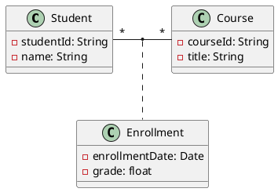
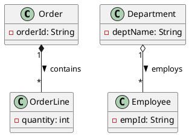

# Báo cáo Tuần 3 – Nghiên cứu về Mô hình hóa Tĩnh (Static Modeling)

Trong tuần 3, em đã tìm hiểu sâu về **Mô hình hóa Tĩnh (Static Modeling)** dựa trên tài liệu bài giảng **Ch07_Static Modeling.pptx**. Dưới đây là nội dung chi tiết về các khái niệm cốt lõi, mối quan hệ cấu trúc giữa các lớp, và phương pháp thiết kế hệ thống tĩnh mà em đã đúc kết được.

---

## 1. Tổng quan về Mô hình hóa Tĩnh (Static Modeling)
Mô hình hóa tĩnh giải quyết góc nhìn **cấu trúc tĩnh** của hệ thống – mô tả những thành phần tồn tại ổn định và không thay đổi theo thời gian, trái ngược với mô hình động (Dynamic Modeling) tập trung vào luồng hành vi/tương tác.

Ba khái niệm cơ bản cấu thành mô hình tĩnh:
- **Đối tượng (Objects):** Đại diện cho một thực thể duy nhất, có danh tính rõ ràng trong thực tế (Ví dụ: `Mary's Account` là một đối tượng cụ thể).
- **Lớp (Classes):** Bản thiết kế hoặc khuôn mẫu mô tả một tập hợp các đối tượng có cùng đặc điểm thuộc tính, hành vi và mối quan hệ (Ví dụ: Lớp `Account`).
- **Thuộc tính (Attribute):** Giá trị dữ liệu mà mỗi đối tượng thuộc lớp đó nắm giữ (Ví dụ: `balance`, `accountNumber`).

---

## 2. Các mối liên kết giữa các lớp (Association)
Mối liên kết thể hiện quan hệ cấu trúc giữa hai hay nhiều lớp, thường được biểu diễn bằng động từ để làm rõ ngữ nghĩa.

### 2.1. Bản số (Multiplicity)
Xác định số lượng thực thể (instances) của một lớp có thể liên kết với một thực thể của lớp khác:
- **1:** Đúng một.
- **0..1:** Tùy chọn (không có hoặc có một).
- **`*` (hoặc 0..`*`):** Nhiều (không hoặc nhiều).
- **1..`*`:** Ít nhất một hoặc nhiều.
- **m..n:** Một khoảng số cụ thể (ví dụ: `2..4`).

### 2.2. Liên kết đặc biệt
- **Liên kết vòng (Unary Association / Self-Association):** Mối quan hệ giữa các thực thể trong cùng một lớp.
  - *Ví dụ:* Một nhân viên (`Employee`) có thể quản lý (`manages`) nhiều nhân viên khác.
- **Liên kết bậc ba (Ternary Association):** Liên kết đồng thời giữa 3 lớp khác nhau.
- **Lớp liên kết (Association Class):** Được sử dụng khi bản thân mối liên kết giữa hai lớp chứa các thuộc tính riêng cần lưu trữ (thường xảy ra ở quan hệ nhiều - nhiều).
  - *Ví dụ:* Mối quan hệ giữa lớp `Student` và `Course` thông qua lớp liên kết `Enrollment` (chứa các thuộc tính như `grade`, `enrollmentDate`).

---

## 3. Phân cấp Cấu thành (Composition) và Tập hợp (Aggregation)
Đây là các dạng đặc biệt của mối quan hệ liên kết thể hiện mô hình **"Toàn thể - Bộ phận" (Whole-Part / "IS PART OF")**.

| Đặc tính | Composition (Cấu thành) | Aggregation (Tập hợp) |
|---|---|---|
| **Mức độ gắn kết** | Rất mạnh (Strong) | Yếu hơn (Weak) |
| **Vòng đời (Lifecycle)** | Khối bộ phận (Part) phụ thuộc hoàn toàn vào khối toàn thể (Whole). Nếu Whole bị hủy, Part cũng bị hủy theo. | Khối bộ phận có thể tồn tại độc lập bên ngoài khối tập hợp. |
| **Tính sở hữu** | Một Part chỉ thuộc về duy nhất một Whole tại một thời điểm. | Một Part có thể được chia sẻ giữa nhiều khối Whole khác nhau. |
| **Ký hiệu UML** | Hình thoi đặc (Filled diamond) ở phía Whole. | Hình thoi rỗng (Empty diamond) ở phía Whole. |
| **Ví dụ thực tế** | `Order` (Đơn hàng) và `OrderLine` (Chi tiết đơn hàng). | `Department` (Phòng ban) và `Employee` (Nhân viên). |

---

## 4. Phân cấp Tổng quát hóa / Chuyên biệt hóa (Generalization / Specialization)
Thể hiện mối quan hệ **Kế thừa (Inheritance / "IS A")** dùng để tối ưu hóa cấu trúc lớp:
- **Tổng quát hóa (Generalization):** Nhóm các thuộc tính và phương thức chung của nhiều lớp vào một **Lớp cha (Superclass)** trừu tượng hơn.
- **Chuyên biệt hóa (Specialization):** Tạo ra các **Lớp con (Subclass)** kế thừa lớp cha nhưng bổ sung thêm các thuộc tính, hành vi đặc thù riêng biệt.
  - *Ký hiệu UML:* Mũi tên tam giác rỗng nét liền chỉ từ Subclass lên Superclass.

---

## 5. Mô hình hóa Ngữ cảnh (Context Modeling)
Giúp định vị ranh giới rõ ràng của hệ thống (System Boundary) bằng cách xác định các thực thể bên ngoài tương tác với phần mềm.

### Phân biệt biểu đồ ngữ cảnh:
- **System Context Diagram:** Coi cả hệ thống (gồm cả phần mềm đang phát triển và phần cứng vận hành) như một hộp đen duy nhất tương tác với môi trường bên ngoài.
- **Software System Context Diagram:** Chỉ coi phần mềm là hộp đen cần phát triển. Các thành phần phần cứng đi kèm được coi là các thực thể bên ngoài (`«external device»`).

### Sử dụng Stereotypes trong Context Model:
UML sử dụng Stereotypes đặt trong dấu ngoặc kép `« »` để phân loại các lớp bên ngoài:
- `«external user»`: Người dùng con người tương tác từ bên ngoài.
- `«external system»`: Hệ thống phần mềm độc lập bên ngoài (ví dụ: Cổng thanh toán, Hệ thống xác thực).
- `«external device»`: Các thiết bị phần cứng ngoại vi (Máy in hóa đơn, đầu đọc thẻ, GPS).
- `«external timer»`: Bộ đếm thời gian kích hoạt các tác vụ định kỳ của hệ thống (Cron jobs).

---

## 6. Mô hình hóa tĩnh các Lớp thực thể (Entity Classes)
Các lớp thực thể (`«entity»` classes) là trọng tâm của mô hình hóa tĩnh. Nhiệm vụ chính của chúng là lưu trữ dữ liệu trạng thái lâu dài (persistent data) của hệ thống.

- **Đặc điểm:** Tồn tại xuyên suốt phiên làm việc và thường ánh xạ trực tiếp xuống các bảng trong cơ sở dữ liệu.
- **Cách tiếp cận thiết kế:** Xác định các thực thể chính, định nghĩa kiểu dữ liệu cho các thuộc tính, xác định khóa chính (hoặc định danh duy nhất) và mô hình hóa các ràng buộc dữ liệu (ví dụ: `{balance >= 0}`).
- **Ví dụ trong hệ thống Online Shopping:** Các lớp thực thể cốt lõi gồm `Customer`, `Catalog`, `Item`, `DeliveryOrder`, và `Inventory`.

---

## 7. Bài học rút ra cho dự án của nhóm
Kiến thức từ chương **Static Modeling** này giúp chúng em định hình chính xác hơn khi vẽ sơ đồ lớp cho dự án của mình:
1. Đảm bảo phân biệt rạch ròi giữa **Composition** và **Aggregation** (tránh thiết kế sai vòng đời dữ liệu của thực thể).
2. Tận dụng **Association Class** khi gặp các mối quan hệ nhiều - nhiều phức tạp có kèm theo dữ liệu phát sinh (ví dụ: Khách hàng đặt bàn có thông tin thời gian đặt, số khách đi cùng cần lưu vào lớp liên kết).
3. Sử dụng đúng các ký hiệu **Stereotype** để phân loại rõ ràng các thành phần bên ngoài như máy in hóa đơn nhà hàng (`«external device»`) hay cổng thanh toán điện tử (`«external system»`).
