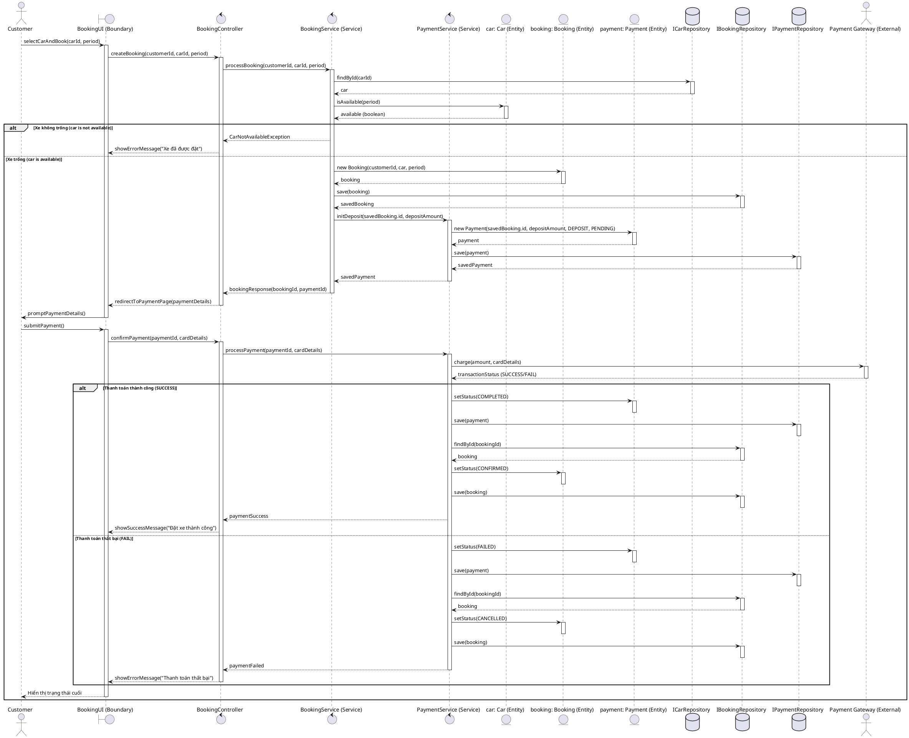
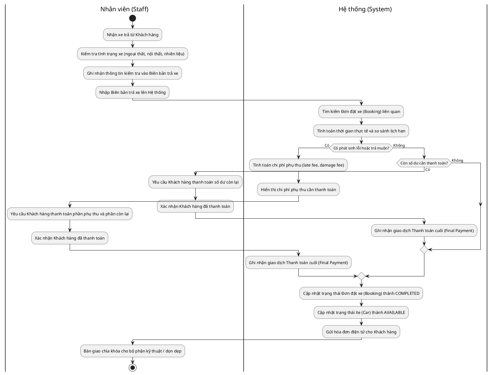

# Báo cáo Thực hành: Bài thi thử số 1 (Practical Exam 1) – Hệ thống AutoGo

Báo cáo này ghi nhận quá trình tự thực hành, đối chiếu kết quả với các tài liệu chuẩn (sử dụng hỗ trợ từ GenAI/ChatGPT) và các lỗi sai đã phát hiện, từ đó đưa ra phương án khắc phục để hoàn thiện bài làm thi thử môn SWD392.

---

## 1. Tóm tắt Đề bài & Ràng buộc Thiết kế
Hệ thống **AutoGo** hỗ trợ dịch vụ cho thuê xe trực tuyến:
- **Khách hàng (Customer)**: Tìm xe, đặt xe (Booking), thanh toán đặt cọc trực tuyến (Deposit), trả xe và thanh toán phần còn lại.
- **Nhân viên (Staff)**: Quản lý phương tiện, xác nhận đặt chỗ, kiểm tra xe khi trả.
- **Hệ thống (System)**: Tự động cập nhật trạng thái đặt chỗ và trạng thái xe.
- **Yêu cầu kỹ thuật**:
  - Lựa chọn mô hình **Kiến trúc phân lớp (Layered Architecture)**.
  - Áp dụng bắt buộc **Repository Pattern** thông qua một Interface chung (Generic Repository).
  - Trình bày toàn bộ thông qua 3 biểu đồ: Class Diagram (Q1), Sequence Diagram (Q2), Activity Diagram (Q3).

---

## 2. Quá trình tự thực hiện và Đối chiếu kết quả

Nhóm/Cá nhân đã tiến hành tự làm bài trong khung thời gian giới hạn (85 phút) bằng công cụ **Draw.io**. Sau đó, tiến hành đối chiếu bản vẽ với lời giải chuẩn và phản hồi phân tích từ trợ lý AI (ChatGPT) để tự đánh giá mức độ chính xác của các ký hiệu UML và tính logic trong thiết kế.

Qua quá trình đối chiếu, em nhận thấy bài làm ban đầu có **3 thiếu sót/lỗi sai nghiêm trọng** cần khắc phục:

### Lỗi 1: Sai ký hiệu mối quan hệ Hiện thực hóa (Realization/Implementation)
- **Hiện trạng:** Đường nối từ các lớp cụ thể (ví dụ: `PaymentRepositoryImpl`) lên các Giao diện (ví dụ: `IPaymentRepository`) đang sử dụng nét liền với mũi tên đặc (`Generalization` - Kế thừa lớp). Điều này sai về mặt cú pháp UML vì mối quan hệ giữa Class và Interface phải là Hiện thực hóa.
- **Khắc phục:** Thay đổi toàn bộ các đường nối này thành **đường nét đứt (dashed line) kèm mũi tên tam giác rỗng** chỉ về phía Interface (`Realization`). Đồng thời đổi nhãn hoặc mã nguồn mô tả thành "implements" thay vì "Extends".

### Lỗi 2: Sai mối quan hệ giữa Booking và Payment
- **Hiện trạng:** Giữa lớp `Booking` và `Payment` ban đầu sử dụng đường liên kết thông thường (Association) kèm chữ mô tả "contains". Điều này không thể hiện được tính phụ thuộc vòng đời dữ liệu.
- **Khắc phục:** Chuyển sang mối quan hệ **Composition (Cấu thành)**. Đầu nối gắn vào lớp `Booking` phải là **hình thoi đặc màu đen (filled diamond)**, đầu nối gắn vào `Payment` là đường thẳng không có mũi tên. Điều này thể hiện rằng: *Một giao dịch thanh toán (Payment) chỉ tồn tại khi gắn với một đơn đặt xe (Booking) cụ thể, và nếu Booking bị xóa bỏ thì các thông tin thanh toán của nó cũng phải bị hủy theo.*

### Lỗi 3: Lỗi chính tả (Typo) và rác dữ liệu từ Template cũ
- **Hiện trạng:**
  - Ở lớp `Car`, thuộc tính `licensePlate: String` bị dính chữ thừa `"lives at"` do sơ xuất khi nhân bản từ thực thể khác từ template cũ.
  - Tại đường nối giữa các Repository xuất hiện các nhãn thừa `"1 name"` chưa được dọn dẹp.
- **Khắc phục:** Thực hiện rà soát kỹ lưỡng, xóa bỏ tất cả các nhãn và thuộc tính thừa để đảm bảo bản vẽ sạch đẹp và chuyên nghiệp.

---

## 3. Bản thiết kế hoàn thiện sau khi sửa đổi (Dạng PlantUML)

Để đảm bảo các sửa đổi được thực hiện chính xác và nhất quán, em đã cập nhật lại thiết kế của cả 3 biểu đồ theo các quy chuẩn UML.

### 3.1. Question 1 – Class Diagram (Sơ đồ Lớp thiết kế)
Biểu đồ dưới đây đã cập nhật mối quan hệ **Composition** (hình thoi đặc `*--`) giữa `Booking` và `Payment`, mối quan hệ **Realization** (nét đứt `<|..`) giữa các `Impl` và `Interface`, kế thừa `User` và làm sạch các thuộc tính của `Car`.

```plantuml
@startuml
skinparam classAttributeIconSize 0
skinparam packageStyle rectangle

package "Domain / Entities" {
    abstract class User {
        - id: String
        - username: String
        - email: String
        - phoneNumber: String
        + getProfile(): String
    }

    class Customer {
        - membershipLevel: String
        - driverLicense: String
        + createBooking(car: Car, period: Period): Booking
    }

    class Staff {
        - role: String
        - employeeId: String
        + manageVehicle(car: Car): void
        + confirmBooking(booking: Booking): void
        + inspectCar(car: Car): InspectionReport
    }

    class Car {
        - id: String
        - model: String
        - licensePlate: String
        - pricePerDay: double
        - status: CarStatus
        + isAvailable(period: Period): boolean
    }

    class Booking {
        - id: String
        - startTime: DateTime
        - endTime: DateTime
        - status: BookingStatus
        - totalAmount: double
        + calculateRemainingAmount(): double
        + confirm(): void
        + cancel(): void
    }

    class Payment {
        - id: String
        - amount: double
        - paymentDate: DateTime
        - type: PaymentType
        - status: PaymentStatus
        + process(): boolean
    }

    enum CarStatus {
        AVAILABLE
        RENTED
        MAINTENANCE
    }

    enum BookingStatus {
        PENDING
        CONFIRMED
        ACTIVE
        COMPLETED
        CANCELLED
    }

    enum PaymentType {
        DEPOSIT
        FINAL
    }

    enum PaymentStatus {
        PENDING
        COMPLETED
        FAILED
    }
}

package "Repositories (Interfaces)" {
    interface IRepository<T> {
        + findById(id: String): T
        + save(entity: T): T
        + delete(id: String): void
        + findAll(): List<T>
    }

    interface IUserRepository {
        + findByEmail(email: String): User
    }

    interface ICarRepository {
        + findAvailableCars(period: Period): List<Car>
    }

    interface IBookingRepository {
        + findByCustomerId(customerId: String): List<Booking>
    }

    interface IPaymentRepository {
        + findByBookingId(bookingId: String): List<Payment>
    }
}

package "Repositories (Implementations)" {
    class UserRepositoryImpl
    class CarRepositoryImpl
    class BookingRepositoryImpl
    class PaymentRepositoryImpl
}

package "Services" {
    class PaymentService {
        - paymentRepository: IPaymentRepository
        - bookingRepository: IBookingRepository
        + processPayment(bookingId: String, amount: double, type: PaymentType): Payment
    }

    class BookingService {
        - bookingRepository: IBookingRepository
        - carRepository: ICarRepository
        - paymentService: PaymentService
        + createBooking(customerId: String, carId: String, period: Period): Booking
    }
}

' Thể hiện quan hệ kế thừa (Inheritance)
User <|-- Customer
User <|-- Staff

' Thể hiện quan hệ Association & Composition
Customer "1" -down-> "*" Booking : creates >
Booking "1" *-down- "*" Payment : composed of >
Booking "*" -right-> "1" Car : links to >

' Thể hiện kế thừa Interface Repository
IRepository <|-- IUserRepository
IRepository <|-- ICarRepository
IRepository <|-- IBookingRepository
IRepository <|-- IPaymentRepository

' Thể hiện quan hệ Hiện thực hóa Interface (Realization - Nét đứt, mũi tên rỗng)
IUserRepository <|.. UserRepositoryImpl : implements
ICarRepository <|.. CarRepositoryImpl : implements
IBookingRepository <|.. BookingRepositoryImpl : implements
IPaymentRepository <|.. PaymentRepositoryImpl : implements

' Thể hiện quan hệ Dependency của Services
BookingService ..> IBookingRepository : depends
BookingService ..> ICarRepository : depends
BookingService --> PaymentService : uses
PaymentService ..> IPaymentRepository : depends
PaymentService ..> IBookingRepository : depends

@endum
```

### 3.2. Question 2 – Sequence Diagram (Sơ đồ Tuần tự: Đặt xe và Đặt cọc)
Thiết kế theo **Kiến trúc phân lớp** kết hợp với **Repository Pattern**, sử dụng các khối `alt` để phân nhánh luồng kiểm tra xe trống và trạng thái thanh toán.

### 3.3. Question 3 – Activity Diagram (Sơ đồ Hoạt động: Trả xe)
Sử dụng phân làn (Swimlanes) cấp độ thiết kế (Level 2 - Design) chia rõ trách nhiệm giữa **Nhân viên (Staff)** và **Hệ thống (System)**.

---

## 4. Bài học kinh nghiệm sau buổi tự đánh giá
1. **Kiểm tra kỹ lưỡng các ký hiệu UML:** Sự khác biệt giữa các mũi tên (đặc biệt là nét đứt và nét liền trong `Realization` và `Generalization`) quyết định tính chính xác của bản vẽ kỹ thuật.
2. **Hiểu rõ ý nghĩa bản chất của các mối quan hệ:** Nhận biết khi nào nên dùng `Composition` thay vì `Association` để phản ánh đúng logic nghiệp vụ trong database và code (Cascade delete, lifecycle dependency).
3. **Giữ gìn tính chuẩn mực cho tài liệu:** Luôn luôn rà soát kỹ các nhãn thừa, ghi chú cũ từ các bản vẽ mẫu (template) trước khi nộp bài để đảm bảo tính chuyên nghiệp.
